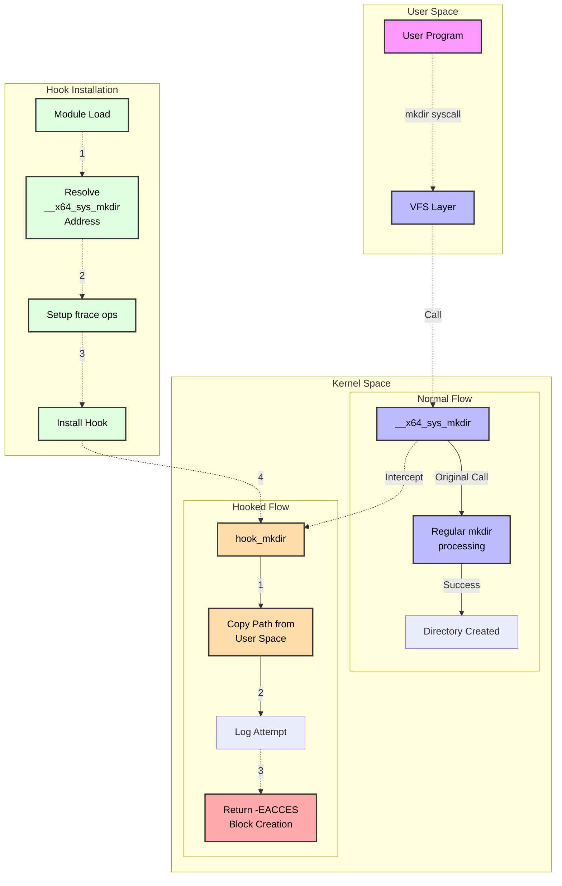

# Adrishya(अदृश्य)

## Introduction
**Adrishya is a Linux kernel module that leverages advanced kernel hooking techniques, specifically using ftrace (the Linux kernel's function tracer) to hook into the mkdir system call. The module is designed to block directory creation attempts in a Linux environment by intercepting and modifying the behavior of the system call responsible for creating directories. This capability is useful for security purposes, such as preventing unauthorized directories from being created on a system.
The module also demonstrates how kernel hooks, credential manipulation, and ftrace-based hooking can be combined for both monitoring and controlling system behavior in a highly efficient and stealthy manner.**<br>
## NOTE 
For the latest version of the project, please switch to the `tcp` branch.
## Hook mkdir POC


## Caution
**only work for x86_64**<br>
**To check architecture of linux os type**<br>
```uname -m```<br>

**check for sycall**<br>
``` cat /proc/kallsyms | grep sys_mkdir```<br>

**in my case**<br>
**ffffffff90babf40 T __x64_sys_mkdir**<br>


## Installation

**1.clone the repository**<br>
```git clone https://github.com/malefax/Adrishya.git```

**2. navigate the directory**<br>
```cd Adrishya/```

**3. generate required files by**<br>
```sudo make```

## Uses
**insert the batchfile by**<br>
```sudo insmod Adrishya.ko```<br>

**now try to make directory in new bash session**<br>
```mkdir test```<br>

## Result
**mkdir: cannot create directory ‘test’: Permission denied**<br>


## Status
```dmesg | tail -n 5```<br>
**[ 5195.072954] mkdir_monitor: Loaded**<br>
**[ 5215.531106] Directory creation blocked: test**<br>

**Check out my blog post about the project:** [here](https://medium.com/@_._.._/mkdir-api-hook-a-pathway-to-an-lkm-rootkit-in-linux-ae5e3fa6d4b8)

