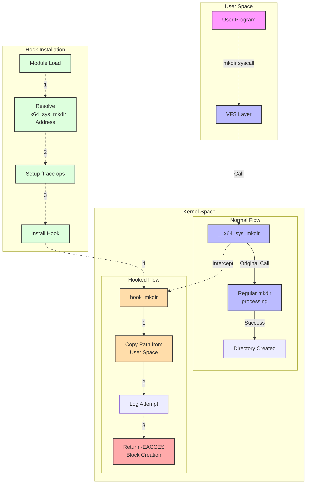
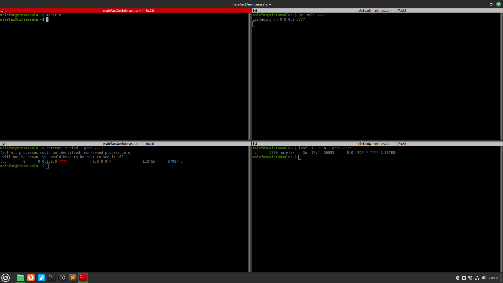
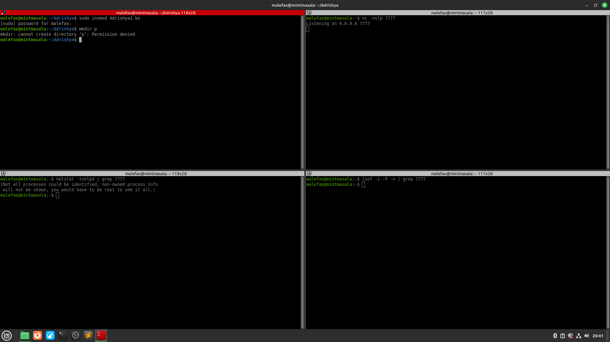

# Adrishya(अदृश्य)


## Introduction
**Adrishya is a Linux kernel module that leverages advanced kernel hooking techniques, specifically using ftrace (the Linux kernel's function tracer) to hook into the mkdir system call. The module is designed to block directory creation attempts in a Linux environment by intercepting and modifying the behavior of the system call responsible for creating directories. This capability is useful for security purposes, such as preventing unauthorized directories from being created on a system.
The module also demonstrates how kernel hooks, credential manipulation, and ftrace-based hooking can be combined for both monitoring and controlling system behavior in a highly efficient and stealthy manner.**<br>



## Caution
**only work for x86_64**<br>
**To check architecture of linux os type**<br>
```uname -m```<br>
## Installation


**1.clone the repository**<br>
```git clone -b tcp  https://github.com/malefax/Adrishya.git```

**2. navigate the directory**<br>
```cd Adrishya/```

**3. To enable hooks change value 0->1 in macros on Adrishya2.c**<br>

```c
#define TCP_HOOK_IS_ENABLED 1
#define MKDIR_HOOK_IS_ENABLED 1
```
**4 To disable hook change the value 1->0 in macros on Adrishya2.c**
  ```c
  #define TCP_HOOK_IS_ENABLED 0
  #define MKDIR_HOOK_IS_ENABLED 0
  ```
**6. By default both is enabled**

**7. generate required files by**<br>
```sudo make```<br>

## Uses
**1. Before inserting batchfile**<br>



**2.After inserting batchfile**<br>
**3.To inserting batch file **<br>

```sudo insmod Adrishya2.ko```<br>




